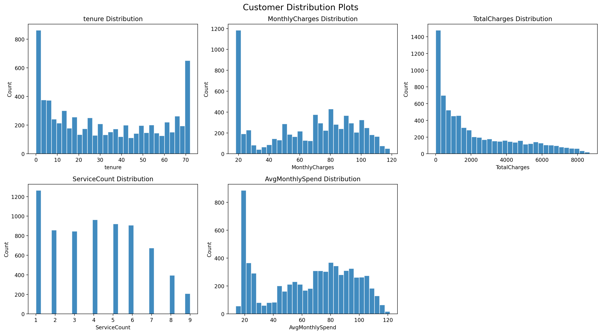
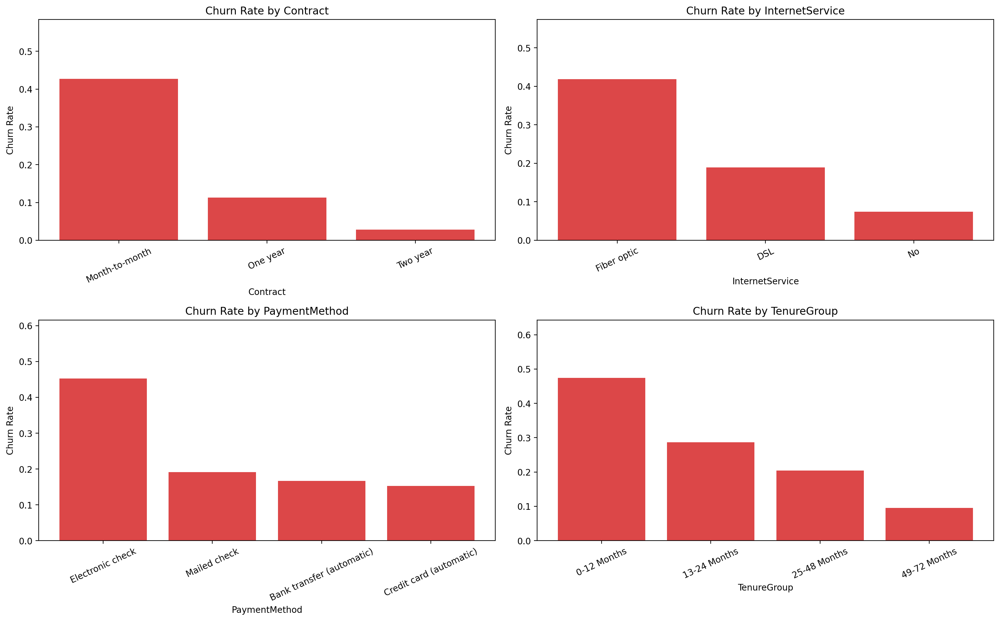
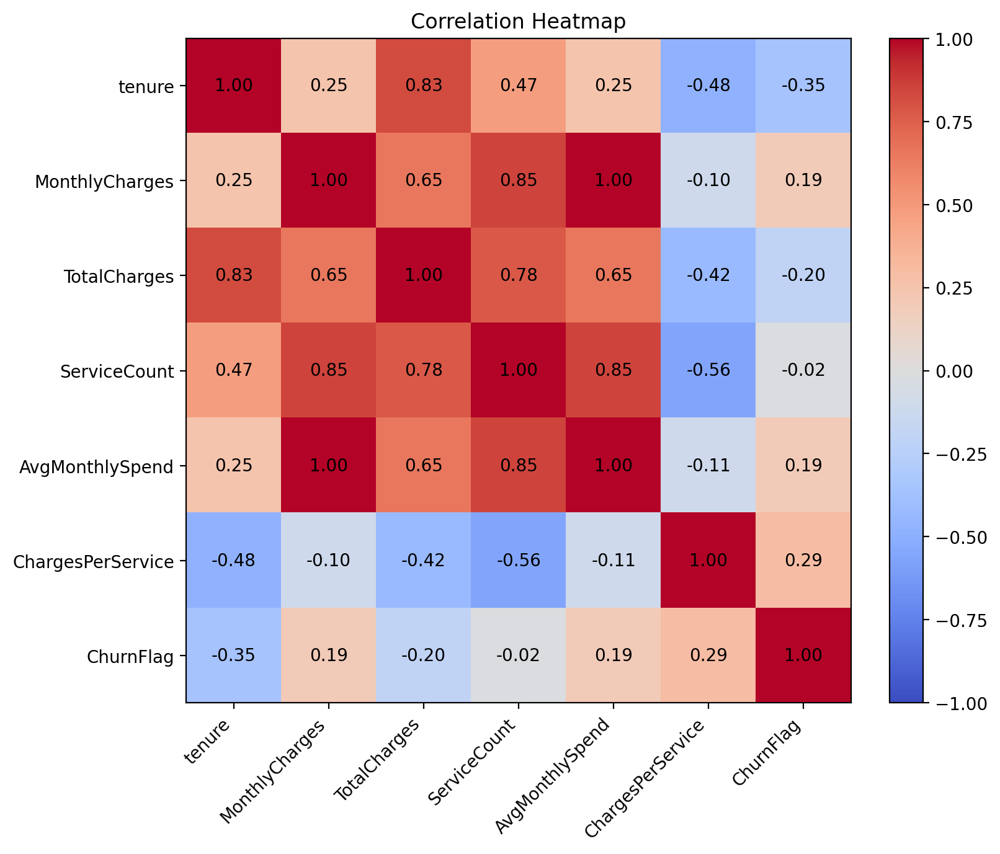

# Customer Churn Prediction Model

An end-to-end machine learning project that predicts customer churn using the **Telco Customer Churn** dataset from Kaggle. The pipeline covers exploratory data analysis, feature engineering, preprocessing, class-imbalance handling with SMOTE, model tuning with GridSearchCV, and performance evaluation across multiple classifiers.

## Overview

Customer churn is one of the most important business problems in subscription-based industries such as telecom, SaaS, banking, and streaming platforms. This project helps identify customers who are likely to leave, so businesses can take targeted retention actions before churn happens.

This repository includes:

- Exploratory data analysis with churn-focused visualizations
- Data cleaning and feature engineering
- One-hot encoding and feature scaling
- SMOTE for class imbalance handling
- Hyperparameter tuning with `GridSearchCV`
- Model comparison using Logistic Regression, Random Forest, and XGBoost
- Evaluation with classification metrics, confusion matrices, ROC-AUC, and feature importance
- Business insights on high-risk customer groups and retention strategies

## Dataset

This project uses the **Telco Customer Churn** dataset from Kaggle.

Download the dataset and place the CSV file here:

```text
data/WA_Fn-UseC_-Telco-Customer-Churn.csv
```

## Project Structure

```text
Customer Churn Prediction Model/
|-- data/
|-- outputs/
|   |-- figures/
|   |-- metrics/
|   `-- models/
|-- src/
|   `-- churn_pipeline.py
|-- .gitignore
|-- README.md
`-- requirements.txt
```

## Features

### Exploratory Data Analysis

The pipeline generates:

- Distribution plots for numeric features
- Correlation heatmap
- Churn analysis across customer segments such as contract type, internet service, payment method, and tenure group

### Data Preprocessing

The workflow includes:

- Missing value handling
- Numeric conversion of `TotalCharges`
- One-hot encoding for categorical variables
- Standard scaling for numeric features

### Feature Engineering

Custom features include:

- `TenureGroup`
- `ServiceCount`
- `AvgMonthlySpend`
- `ChargesPerService`
- `IsLongTermCustomer`

### Modeling

The following models are trained and compared:

- Logistic Regression
- Random Forest Classifier
- XGBoost Classifier

Each model is tuned using `GridSearchCV`, and class imbalance is handled with `SMOTE` inside the training pipeline.

## Evaluation Metrics

Models are evaluated using:

- Accuracy
- Precision
- Recall
- F1-score
- ROC-AUC
- Confusion Matrix

The best-performing model is selected based primarily on ROC-AUC, with recall and accuracy also considered.

## Output Artifacts

After running the pipeline, generated outputs are saved in:

- `outputs/figures/`
  - distribution plots
  - 
  - churn segment plots
  - 
  - correlation heatmap
  - 
  - confusion matrices
  - ROC curves
  - model comparison chart
  - feature importance chart
- `outputs/metrics/`
  - model metrics CSV
  - classification reports JSON
  - segment churn summary
  - feature importance CSV
  - business insights text file
- `outputs/models/`
  - best model summary metadata

## Installation

Use Python **3.10** for this project.

```powershell
py -3.10 -m pip install -r requirements.txt
```

## Run the Project

```powershell
py -3.10 src/churn_pipeline.py
```

Optional arguments:

```powershell
py -3.10 src/churn_pipeline.py --data "data/WA_Fn-UseC_-Telco-Customer-Churn.csv" --test-size 0.2 --random-state 42
```

## Workflow

The pipeline follows these steps:

1. Load the dataset
2. Clean and prepare the data
3. Perform feature engineering
4. Generate EDA visualizations
5. Split data into training and test sets
6. Build preprocessing and modeling pipelines
7. Apply SMOTE on the training workflow
8. Tune each model with `GridSearchCV`
9. Evaluate all models
10. Save metrics, plots, and model summaries


## Business Insights

This project is designed to support decision-making, not just model training. In this dataset, customers with the highest churn risk often belong to segments such as:

- Month-to-month contract customers
- Customers with short tenure
- Fiber optic internet users with higher monthly charges
- Customers without support or protection add-on services

### Example Retention Strategies

- Offer discounts or loyalty incentives for month-to-month customers
- Improve onboarding for new customers in early tenure stages
- Bundle value-added services such as tech support or online security
- Review pricing and support quality for high-charge customers


## Tech Stack

- Python
- Pandas
- NumPy
- scikit-learn
- imbalanced-learn
- XGBoost
- Matplotlib

## Notes

- The default `python` command on this machine points to Python `3.13`, while the ML dependencies are installed for Python `3.10`.
- Run this project using `py -3.10` to avoid package import errors such as `ModuleNotFoundError: No module named 'imblearn'`.
- The target of 85%+ accuracy depends on the final train/test split, tuning results, and dataset behavior.
- For churn prediction, recall and ROC-AUC are often more important than accuracy alone.

## Future Improvements

- Add cross-validation result visualizations
- Export the trained best model as a reusable serialized artifact
- Build a Streamlit or Flask dashboard for churn prediction
- Add SHAP-based explainability for model interpretation

## License

This project is for educational and portfolio use. Please check the original dataset license and Kaggle terms before redistribution.
